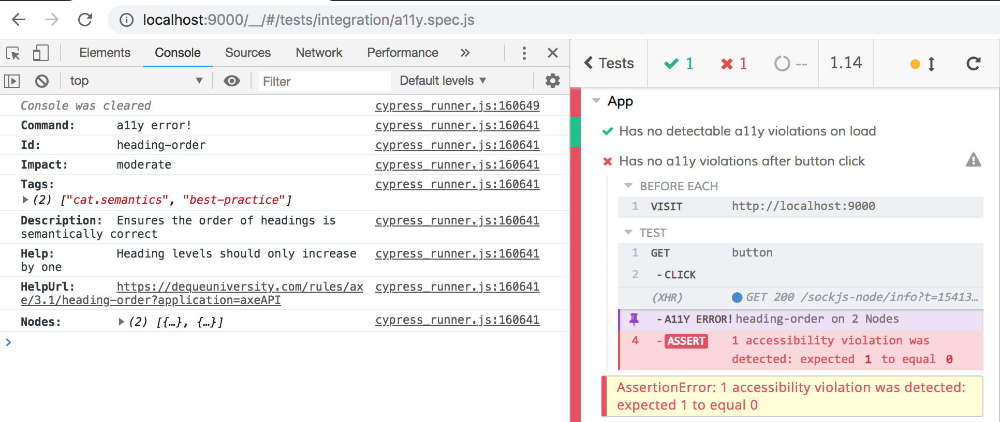

# cypress-axe
[](#contributors)

This package provides three simple [Cypress](https://cypress.io) commands to help test your applications for accessibility issues using [axe-core](https://github.com/dequelabs/axe-core).

## Install and configure

### Add as a dev dependency:

```sh
npm i -D cypress-axe
```

### Install peer dependencies:

```sh
npm i -D cypress axe-core
```

### Include the commands

Update `Cypress/support/index.js` file to include the cypress-axe commands by adding:

```js
import 'cypress-axe'
```

### Add a task to log the messages to the terminal when the cypress executes the spec files

[Example - configuring log task](https://docs.cypress.io/api/commands/task.html#Usage)

## Commands

### cy.injectAxe

This will inject the `axe-core` runtime into the page under test. You must run this after a call to `cy.visit()` and before you run the `checkA11y` command.

You run this command with `cy.injectAxe()` either in your test, or in a `beforeEach`, as long as the `visit` comes first.

```js
beforeEach(() => {
  cy.visit('http://localhost:9000')
  cy.injectAxe()
})
```
### cy.configureAxe

#### Purpose
To configure the format of the data used by aXe. This can be used to add new rules, which must be registered with the library to execute.

#### Description
User specifies the format of the JSON structure passed to the callback of axe.run

[Link - aXe Docs: axe.configure](https://www.deque.com/axe/documentation/api-documentation/#api-name-axeconfigure)

```js
it('Has no detectable a11y violations on load (custom configuration)', () => {
  // Configure aXe and test the page at initial load
  cy.configureAxe({
    branding: {
      brand: String,
      application: String
    },
    reporter: "option",
    checks: [Object],
    rules: [Object],
    locale: Object
  })
  cy.checkA11y()
})
```

### cy.checkA11y

This will run axe against the document at the point in which it is called. This means you can call this after interacting with your page and uncover accessibility issues introduced as a result of rendering in response to user actions.

#### Parameters on cy.checkA11y (axe.run)
context: (optional) Defines the scope of the analysis - the part of the DOM that you would like to analyze. This will typically be the document or a specific selector such as class name, ID, selector, etc.

options: (optional) Set of options passed into rules or checks, temporarily modifying them. This contrasts with axe.configure, which is more permanent.

[Link - aXe Docs: axe.run Parameters](https://www.deque.com/axe/documentation/api-documentation/#parameters-axerun)

```js
it('Has no detectable a11y violations on load', () => {
  // Test the page at initial load
  cy.checkA11y()
})

it('Has no detectable a11y violations on load (with custom parameters)', () => {
  // Test the page at initial load (with context and options)
  cy.checkA11y(
    ".example-class", {
      runOnly: {
        type: "tag",
        values: ["wcag2a"]
      }
    }
  )
})

it('Has no a11y violations after button click', () => {
  // Interact with the page, then check for a11y issues
  cy.get('button').click()
  cy.checkA11y()
})
```

Optionally you can also pass additional argument `skipFailures` to disable the failures and only log them to the console output 

Reference : https://github.com/avanslaars/cypress-axe/issues/17

## Output

When accessibility violations are detected, your test will fail and an entry titled "A11Y ERROR!" will be added to the command log for each type of violation found (they will be above the failed assertion). Clicking on those will reveal more specifics about the error in the DevTools console.



## Contributors

Thanks goes to these wonderful people ([emoji key](https://github.com/all-contributors/all-contributors#emoji-key)):

<!-- ALL-CONTRIBUTORS-LIST:START - Do not remove or modify this section -->
<!-- prettier-ignore-start -->
<!-- markdownlint-disable -->
<table>
  <tr>
    <td align="center"><a href="https://samcus.co"><br /><sub><b>Samuel Custer</b></sub></a><br /><a href="https://github.com/avanslaars/cypress-axe/commits?author=samcus" title="Code">💻</a> <a href="https://github.com/avanslaars/cypress-axe/commits?author=samcus" title="Documentation">📖</a></td>
    <td align="center"><a href="https://github.com/miketoth"><br /><sub><b>Michael Toth</b></sub></a><br /><a href="https://github.com/avanslaars/cypress-axe/commits?author=miketoth" title="Code">💻</a></td>
    <td align="center"><a href="https://github.com/NicholasBoll"><br /><sub><b>Nicholas Boll</b></sub></a><br /><a href="https://github.com/avanslaars/cypress-axe/commits?author=NicholasBoll" title="Code">💻</a></td>
  </tr>
</table>

<!-- markdownlint-enable -->
<!-- prettier-ignore-end -->
<!-- ALL-CONTRIBUTORS-LIST:END -->

This project follows the [all-contributors](https://github.com/all-contributors/all-contributors) specification. Contributions of any kind welcome!
